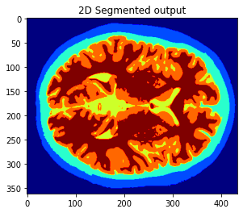
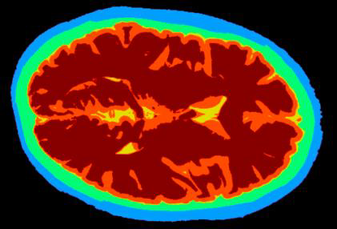

# Brain-MRI-segmentation

## Dataset

The file ‘Brain.mat’ contains 10 consecutive ‘axial’ cross-sections of a publicly available MRI of a single human subject.
The images are T1 weighted MRI images (each slice has a dimension of 362*434 pixel) with each z-slice being at 1
mm interval (spanning 10 mm), Figure 1.

Figure 1: T1 weighted MRI data at 10 consecutive slices

Figure 2: Segmented ‘labelled’ regions of the T1 weighted data in Figure 1

## The task

To segment out regions/labels before further analysis of our data. 

Task 1: 2D tissue segmentation - Develop and apply segmentation algorithm to each slice of the MRI data

Task 2: 3D tissue segmentation - Implement 3D segmentation algorithm that can be applied to all slices simultaneously

## Implementation

A step by step segmentation walkthrough is given in demo.ipynb

## Results

#### 2D segmentation:

Dice coefficient - 0.86

 

#### 3D segmentation:

 Dice coefficient - 0.86

 

